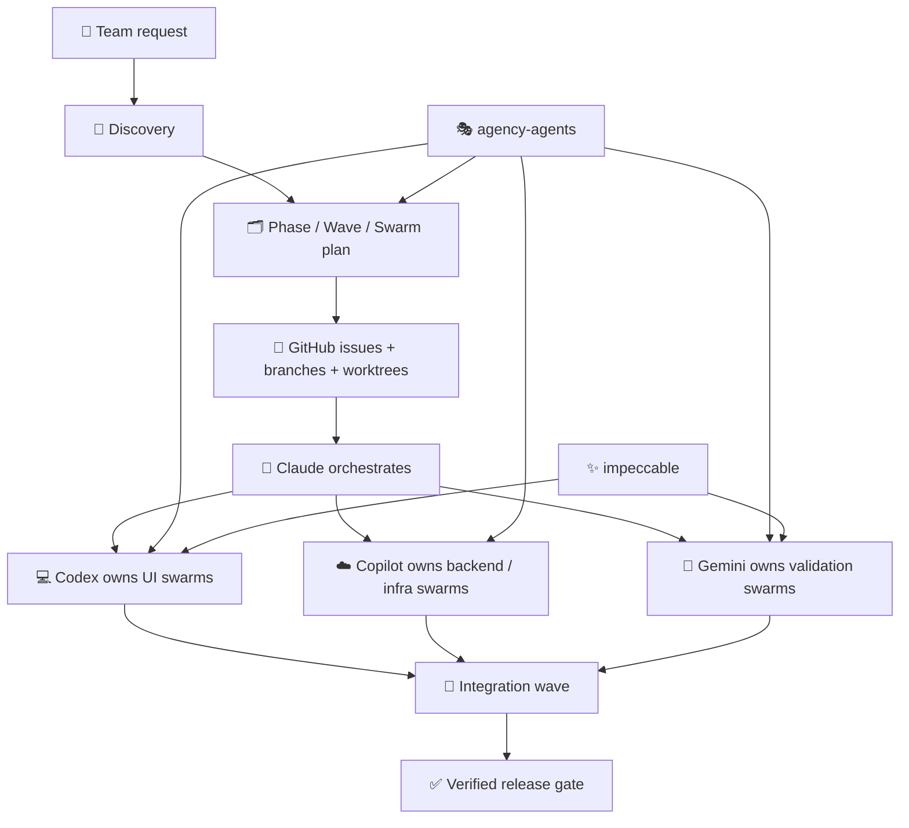

<div align="center">


</div>

<!-- readme-gen:start:badges -->
<p align="center">
  
  
  
  
</p>

<p align="center">
  
  
  
  
</p>
<!-- readme-gen:end:badges -->

> Most multi-agent software efforts break down at the seams: unclear ownership, overlapping edits, drifting contracts, and messy handoffs. **Swarm Architect** gives teams a contract-first orchestration layer that turns vague work into phases, waves, swarms, GitHub issues, and explicit validation — so Claude can coordinate while Codex, Copilot, and Gemini execute without stepping on each other.


## Why teams use Swarm Architect

<table>
<tr>
<td width="50%" valign="top">

### 🧭 Orchestrates before it delegates
Discovery comes first. Plans are shaped before worker agents are launched.

</td>
<td width="50%" valign="top">

### 🌊 Phase → Wave → Swarm structure
Large work is decomposed into explicit parallel tracks with dependency-aware sequencing.

</td>
</tr>
<tr>
<td width="50%" valign="top">

### 🔒 Contract-first parallelism
Shared contracts are frozen before Codex, Copilot, or Gemini start parallel execution.

</td>
<td width="50%" valign="top">

### 🔗 GitHub-native execution
Tasks map cleanly into issues, branches, worktrees, handoffs, and validation evidence.

</td>
</tr>
</table>

## What's inside

| Path | Purpose |
|---|---|
| [`SKILL.md`](./SKILL.md) | Main skill entrypoint and operating contract |
| [`templates/`](./templates) | Reusable templates for discovery, planning, issue sync, and handoffs |
| [`playbooks/`](./playbooks) | Multi-agent operating rules, GitHub sync, worktree strategy, verification gates |
| [`schemas/`](./schemas) | Structured task, issue, and role-mapping defaults |
| [`examples/`](./examples) | Concrete examples for plans, waves, and agent assignments |
| [`docs/`](./docs) | Integration guidance for pairing Swarm Architect with other repos and methodologies |
| [`icon.svg`](./icon.svg) | UI icon for the skill package |

## Quick start

### Install as a Craft Agent skill

```bash
git clone https://github.com/Sheshiyer/swarm-architect-skill.git
mkdir -p ~/.craft-agent/workspaces/<your-workspace>/skills/swarm-architect
cp -R swarm-architect-skill/* ~/.craft-agent/workspaces/<your-workspace>/skills/swarm-architect/
```

Then invoke it in your planning workflow by referencing the skill and providing your repo/spec context.

### Use it as a reusable orchestration reference

If you are not using Craft Agent directly, you can still reuse the package as:
- a planning protocol,
- a swarm decomposition reference,
- a GitHub issue/worktree operating manual,
- and a concrete Claude/Codex/Copilot/Gemini coordination model.


## Concrete operating model

By default, this repo assumes the following stack:

- **Claude** → planner / orchestrator
- **Codex** → UI and app implementation
- **Copilot** → backend, cloud, CI/CD, and deployment wiring
- **Gemini** → validation, regression analysis, and adversarial testing

See the full operating manual here:
- [`playbooks/claude-codex-copilot-gemini-operating-model.md`](./playbooks/claude-codex-copilot-gemini-operating-model.md)

## Execution model

<!-- readme-gen:start:architecture -->

<!-- readme-gen:end:architecture -->

### Core rules
- One issue → one owner → one branch/worktree
- Freeze contracts before parallel implementation
- Serialize lock-zone files like `package.json`, lockfiles, CI config, and shared generated types
- Merge at wave boundaries instead of constant cross-branch syncing
- Require evidence before any task, swarm, or wave is considered done

## Project structure

<!-- readme-gen:start:tree -->
```text
📦 swarm-architect-skill
├── 📄 SKILL.md                         # Main skill entrypoint
├── 🎨 icon.svg                         # UI icon
├── 📂 templates/                       # Discovery, planning, issue, handoff, and memory capture scaffolds
│   ├── discovery-template.md
│   ├── phase-wave-swarm-template.md
│   ├── github-issue-template.md
│   ├── agent-handoff-template.md
│   └── openviking-memory-capture-template.md
├── 📂 playbooks/                       # Operating manuals and guardrails
│   ├── multi-agent-boundaries.md
│   ├── worktree-strategy.md
│   ├── verification-gates.md
│   ├── github-sync.md
│   ├── claude-codex-copilot-gemini-operating-model.md
│   └── openviking-memory-ops.md
├── 📂 schemas/                         # Structured defaults for tasks and issue mapping
│   ├── task-schema.json
│   ├── issue-mapping-schema.json
│   └── agent-role-matrix.yaml
├── 📂 examples/                        # Sample plan, wave, and assignment outputs
│   ├── sample-plan.md
│   ├── sample-wave.md
│   └── sample-agent-assignment.md
└── 📂 docs/                            # External integration and memory mapping guides
    ├── agency-agents-mapping.md
    ├── impeccable-mapping.md
    └── openviking-memory-mapping.md
```
<!-- readme-gen:end:tree -->

## Memory-aware swarm model

Swarm Architect can also pair with **OpenViking** to make the whole swarm memory-aware.

In that setup:
- **Swarm Architect** stays the orchestration plane
- **OpenViking** becomes the shared context and memory plane

That means tasks, swarms, waves, and validation lanes can read and write durable memory through deterministic `viking://` paths instead of relying only on prompt-local context.

## Pair it with other systems

### 🎭 Pair with Agency Agents
Use **agency-agents** as your specialist workforce library.

Swarm Architect remains the orchestration layer; agency-agents provides deeper role-specific execution profiles for UI, backend, infra, QA, and project operations through fields like `execution_profile` and `validation_profile`.

Start here:
- [`docs/agency-agents-mapping.md`](./docs/agency-agents-mapping.md)
- Upstream repo: [msitarzewski/agency-agents](https://github.com/msitarzewski/agency-agents)

### ✨ Pair with Impeccable
Use **impeccable** as your frontend quality layer.

Swarm Architect decides ownership and sequencing; impeccable sharpens UI review with critique, audit, polish, distill, and anti-pattern steering through the `quality_profile` layer.

Start here:
- [`docs/impeccable-mapping.md`](./docs/impeccable-mapping.md)
- Upstream repo: [pbakaus/impeccable](https://github.com/pbakaus/impeccable)

### 🧠 Pair with OpenViking
Use **OpenViking** as your swarm memory backend.

Swarm Architect remains the control plane; OpenViking stores shared project memory, wave memory, swarm-local memory, task handoffs, and validation records through deterministic `viking://` URIs.

Start here:
- [`docs/openviking-memory-mapping.md`](./docs/openviking-memory-mapping.md)
- Upstream repo: [volcengine/OpenViking](https://github.com/volcengine/OpenViking)

## Composable task model

Swarm Architect now supports a layered task model:
- **`owner_agent`** → the concrete runtime owner, such as `codex`, `copilot`, `gemini`, or `claude`
- **`execution_profile`** → the specialist worker overlay, such as `agency/engineering-frontend-developer`
- **`quality_profile`** → the quality methodology overlay, such as `impeccable/polish`
- **`validation_profile`** → the validation specialist overlay, such as `agency/testing-reality-checker`
- **`memory_scope`** → where the record lives in the memory hierarchy, such as `task` or `wave`
- **`memory_uri`** → the primary OpenViking location for that work item
- **`memory_inputs`** → the memory records that should be loaded before execution starts
- **`memory_outputs`** → the records that should be written after completion

Example:

```json
{
  "owner_agent": "codex",
  "execution_profile": "agency/engineering-frontend-developer",
  "quality_profile": "impeccable/polish",
  "validation_profile": "agency/testing-reality-checker",
  "memory_scope": "task",
  "memory_uri": "viking://agent/memories/swarms/checkout/tasks/T-042",
  "memory_inputs": [
    "viking://resources/projects/checkout/architecture/.overview"
  ],
  "memory_outputs": [
    "completion-summary",
    "validation-evidence",
    "handoff-note"
  ]
}
```

This keeps orchestration stable while allowing you to swap specialist behavior and quality methodology without redesigning the plan.

## Example use cases

- Plan a multi-sprint product build with explicit phase → wave → swarm decomposition
- Split UI, backend, and QA work cleanly across Codex, Copilot, and Gemini
- Turn architecture work into GitHub-native issue graphs with branch/worktree isolation
- Add specialist worker overlays from `agency-agents`
- Add stronger frontend critique and polish loops from `impeccable`
- Compose runtime ownership with execution, quality, and validation overlays per task

## Examples

- [`examples/sample-plan.md`](./examples/sample-plan.md)
- [`examples/sample-wave.md`](./examples/sample-wave.md)
- [`examples/sample-agent-assignment.md`](./examples/sample-agent-assignment.md)

## Contributing

If you evolve the methodology, keep the separation clean:
- **Swarm Architect** for planning and orchestration
- **agency-agents** for specialist worker profiles
- **impeccable** for frontend quality methodology

That boundary is what keeps the system composable instead of tangled.

## License

No license file is included yet. If you plan to encourage broad reuse, add a license in the next revision.

<!-- readme-gen:start:footer -->
<div align="center">


**Built for teams running structured multi-agent delivery.**

</div>
<!-- readme-gen:end:footer -->
