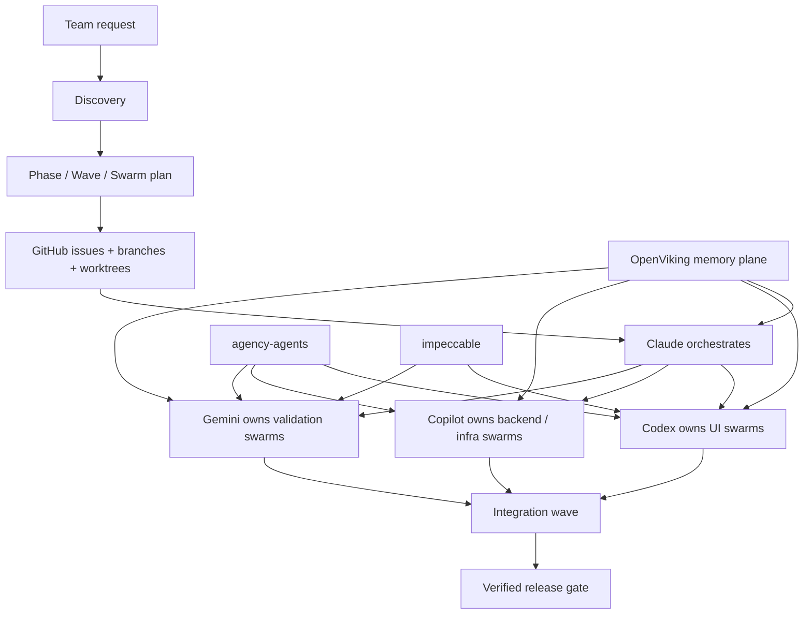

# Swarm Architect

<p align="center">
  
</p>

<p align="center">
  Multi-agent planning and orchestration for <strong>Claude + Codex + Copilot + Gemini</strong>, with phase → wave → swarm execution, GitHub-native tracking, and OpenViking-ready memory design.
</p>

<!-- readme-gen:start:badges -->
<p align="center">
  
  
  
  
</p>

<p align="center">
  
  
  
  
</p>
<!-- readme-gen:end:badges -->

Most multi-agent software efforts fail in the seams: unclear ownership, overlapping edits, drifting contracts, and weak handoffs. **Swarm Architect** gives teams a contract-first orchestration layer that turns vague work into explicit phases, waves, swarms, GitHub issues, and validation gates — so worker agents can execute without breaking each other.

---

## Why teams use Swarm Architect

<table>
<tr>
<td width="50%" valign="top">

### 🧭 Orchestrates before it delegates
Discovery comes first. Plans are shaped before worker agents are launched.

</td>
<td width="50%" valign="top">

### 🌊 Phase → Wave → Swarm structure
Large work is decomposed into explicit parallel tracks with dependency-aware sequencing.

</td>
</tr>
<tr>
<td width="50%" valign="top">

### 🔒 Contract-first parallelism
Shared contracts are frozen before Codex, Copilot, or Gemini start parallel execution.

</td>
<td width="50%" valign="top">

### 🧠 Memory-aware by design
OpenViking-ready fields and URI conventions make shared swarm memory explicit and auditable.

</td>
</tr>
</table>

## What's inside

| Path | Purpose |
|---|---|
| [`SKILL.md`](./SKILL.md) | Main skill entrypoint and operating contract |
| [`templates/`](./templates) | Reusable templates for discovery, planning, issue sync, handoffs, and memory capture |
| [`playbooks/`](./playbooks) | Multi-agent rules, GitHub sync, worktree strategy, verification, memory ops |
| [`schemas/`](./schemas) | Structured task, issue, profile, and memory defaults |
| [`examples/`](./examples) | Concrete examples for plans, waves, and agent assignments |
| [`docs/`](./docs) | Integration guidance, memory mapping, and bootstrap documentation |
| [`scripts/`](./scripts) | Install helper, bootstrap helpers, and OpenViking indexing helper |
| [`.swarm-bootstrap.example.json`](./.swarm-bootstrap.example.json) | Example local bootstrap config |
| [`icon.svg`](./icon.svg) | UI icon for the skill package |

## Install

### Option 1 — Use the install helper

```bash
git clone https://github.com/Sheshiyer/swarm-architect-skill.git
cd swarm-architect-skill
./scripts/install-skill.sh --workspace ~/.craft-agent/workspaces/my-workspace
```

### Option 2 — Install to an explicit destination

```bash
./scripts/install-skill.sh --dest ~/.craft-agent/workspaces/my-workspace/skills/swarm-architect
```

### Option 3 — Manual copy

```bash
mkdir -p ~/.craft-agent/workspaces/my-workspace/skills/swarm-architect
cp -R ./* ~/.craft-agent/workspaces/my-workspace/skills/swarm-architect/
```

## How to use

### 1. Invoke the skill
Use the skill when you need structured planning for multi-agent execution.

Examples:
- architecture planning
- multi-sprint delivery planning
- GitHub issue decomposition
- Claude/Codex/Copilot/Gemini ownership splitting
- OpenViking memory-aware swarm planning

### 2. Run discovery first
Start by capturing:
- planning depth
- delivery mode
- release model
- quality bar
- runtime agents available
- ownership split
- external constraints

### 3. Generate the plan
Swarm Architect should then produce:
- phases
- waves
- swarms
- dependency logic
- task list
- verification strategy
- GitHub sync strategy

### 4. Assign runtime owners and overlays
Each task can define:
- `owner_agent`
- `execution_profile`
- `quality_profile`
- `validation_profile`
- `memory_scope`
- `memory_uri`

### 5. Optional bootstrap for upstreams and OpenViking
If you want specialist overlays and memory-aware structure:

```bash
cp .swarm-bootstrap.example.json .swarm-bootstrap.json
./scripts/bootstrap-upstreams.sh
./scripts/bootstrap-openviking.sh
./scripts/index-openviking-resources.sh --dry-run
./scripts/index-openviking-resources.sh --wait
```

This will:
- clone `agency-agents` once
- clone `impeccable` once
- generate `.swarm-upstream-resources.json`
- generate `.swarm-openviking-paths.json`
- preview the exact OpenViking ingestion commands
- index the discovered upstream repos into `viking://resources/upstreams/...`

### 6. Pair with other systems as needed
- **agency-agents** → specialist execution overlays
- **impeccable** → frontend critique/polish overlays
- **OpenViking** → shared context and memory plane

## Install helper

A shell helper is included at:
- [`scripts/install-skill.sh`](./scripts/install-skill.sh)

It supports:
- `--workspace <path>`
- `--dest <path>`
- `--dry-run`

Example:

```bash
./scripts/install-skill.sh --workspace ~/.craft-agent/workspaces/my-workspace --dry-run
```

## First-run bootstrap

Swarm Architect includes a bootstrap layer for local setup.

It can:
- clone `agency-agents` once into `.external/agency-agents`
- clone `impeccable` once into `.external/impeccable`
- generate `.swarm-upstream-resources.json` so those repos become OpenViking-ingestable
- prepare OpenViking config guidance
- generate deterministic memory path conventions for the current repo, including upstream resource roots when available
- ingest the discovered upstream repos into OpenViking with a dedicated follow-up script

Recommended flow:

```bash
cp .swarm-bootstrap.example.json .swarm-bootstrap.json
./scripts/bootstrap-upstreams.sh
./scripts/bootstrap-openviking.sh
./scripts/index-openviking-resources.sh --dry-run
./scripts/index-openviking-resources.sh --wait
```

See:
- [`docs/bootstrap.md`](./docs/bootstrap.md)

## OpenViking indexing

A dedicated helper is included at:
- [`scripts/index-openviking-resources.sh`](./scripts/index-openviking-resources.sh)

It consumes the generated `.swarm-upstream-resources.json` file and runs the real OpenViking CLI ingestion step using the documented `openviking add-resource ...` flow.

It supports:
- `--dry-run`
- `--wait`
- `--replace-existing`
- `--only <name>`
- `--cli <command>`

Examples:

```bash
./scripts/index-openviking-resources.sh --dry-run
./scripts/index-openviking-resources.sh --only agency-agents --wait
./scripts/index-openviking-resources.sh --replace-existing --wait
```

## Concrete operating model

By default, this repo assumes the following stack:
- **Claude** → planner / orchestrator
- **Codex** → UI and app implementation
- **Copilot** → backend, cloud, CI/CD, and deployment wiring
- **Gemini** → validation, regression analysis, and adversarial testing

See:
- [`playbooks/claude-codex-copilot-gemini-operating-model.md`](./playbooks/claude-codex-copilot-gemini-operating-model.md)

## Execution model

<!-- readme-gen:start:architecture -->

<!-- readme-gen:end:architecture -->

### Core rules
- One issue → one owner → one branch/worktree
- Freeze contracts before parallel implementation
- Serialize lock-zone files like `package.json`, lockfiles, CI config, and shared generated types
- Merge at wave boundaries instead of constant cross-branch syncing
- Require evidence before any task, swarm, or wave is considered done

## Memory-aware task model

Swarm Architect supports a layered task model:
- **`owner_agent`** → concrete runtime owner (`codex`, `copilot`, `gemini`, `claude`)
- **`execution_profile`** → specialist worker overlay (`agency/...`)
- **`quality_profile`** → methodology overlay (`impeccable/...`)
- **`validation_profile`** → validation overlay (`agency/...`)
- **`memory_scope`** → where the record lives (`task`, `wave`, `swarm`, etc.)
- **`memory_uri`** → the primary OpenViking location
- **`memory_inputs`** → records loaded before execution
- **`memory_outputs`** → records written after completion

```json
{
  "owner_agent": "codex",
  "execution_profile": "agency/engineering-frontend-developer",
  "quality_profile": "impeccable/polish",
  "validation_profile": "agency/testing-reality-checker",
  "memory_scope": "task",
  "memory_uri": "viking://agent/memories/swarms/checkout/tasks/T-042",
  "memory_inputs": [
    "viking://resources/projects/checkout/architecture/.overview"
  ],
  "memory_outputs": [
    "completion-summary",
    "validation-evidence",
    "handoff-note"
  ]
}
```

## Pair it with other systems

### Agency Agents
Use **agency-agents** for specialist workforce overlays.
- [`docs/agency-agents-mapping.md`](./docs/agency-agents-mapping.md)
- Upstream: [msitarzewski/agency-agents](https://github.com/msitarzewski/agency-agents)

### Impeccable
Use **impeccable** for frontend critique and polish overlays.
- [`docs/impeccable-mapping.md`](./docs/impeccable-mapping.md)
- Upstream: [pbakaus/impeccable](https://github.com/pbakaus/impeccable)

### OpenViking
Use **OpenViking** as the swarm memory backend.
- [`docs/openviking-memory-mapping.md`](./docs/openviking-memory-mapping.md)
- Upstream: [volcengine/OpenViking](https://github.com/volcengine/OpenViking)

## Examples
- [`examples/sample-plan.md`](./examples/sample-plan.md)
- [`examples/sample-wave.md`](./examples/sample-wave.md)
- [`examples/sample-agent-assignment.md`](./examples/sample-agent-assignment.md)

## Contributing
If you evolve the methodology, keep the separation clean:
- Swarm Architect → planning and orchestration
- agency-agents → specialist worker profiles
- impeccable → frontend quality methodology
- OpenViking → memory plane

## License
No license file is included yet. Add one in the next revision if you want broad reuse clarity.
